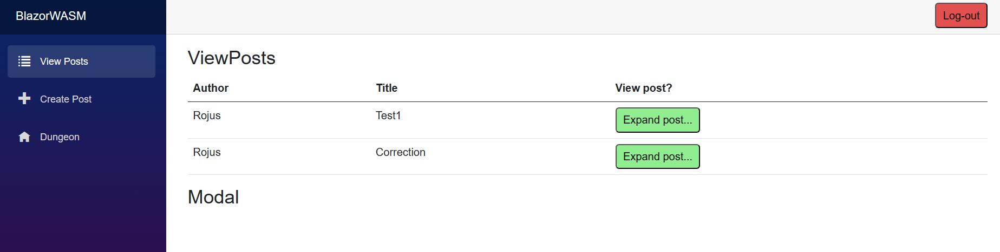

# DNP Social Media Assignment
This is a starter/demo version of a social media web application written in C# and using Blazor.

## Table of contents
- [DNP Social Media Assignment](#dnp-social-media-assignment)
  - [Table of Contents](#table-of-contents)
  - [About](#about)
  - [Services](#services)
  - [Installation](#installation)
  - [License](#license)


## About
This is a course assignment for DNP1. The focus of it was to create a social media webapp using C# and blazzor. The main parts of interest are UI using blazzor, Web API, Database usage and authentication methods. Keep in mind it is highly underdeveloped and was created for educational purposes only. 
## Features

- Create User
- Login/Logout
- Creating Posts
- Viewing all Posts
- Viewing post details
- Authentication


## Services

### WEB API
This service is responsible for providing access to the data for the frontend UI. More specifically it provides an API to access the data stored in the an SQL lite database and grants the possibility to alter it.

### Blazor Interface
This service provides a user interface that will be used by a person to access certain features of the system. It uses Blazzor technologies for different pages and retrieves all the data using the API services mentioned above. 
## Installation
To install the application simply clone the repository into your local machine.
```bash
git clone https://github.com/RyzhasMomentas/DNP-1Y-Assignment1-Assignment2.git
```
Compile the code and run both BlazorWASM and WebAPI processes.

(Missing picture)
    
## License

This project is under the [MIT](https://choosealicense.com/licenses/mit/). You are welcome to use, modify and distribute the code freely.
